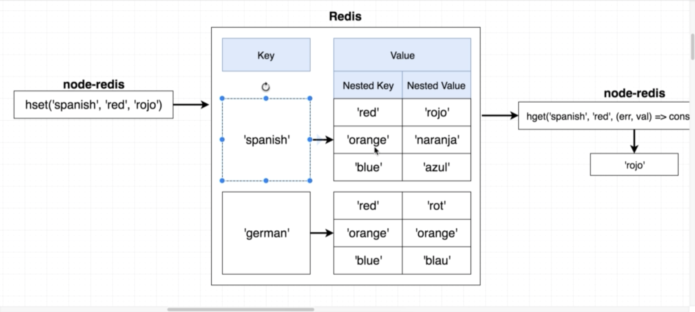

# Node Cachine Server

Redis is an in memory data store. Redis allows you to read and write data very quickly.

Once it gets turned off, restarted, or after an alloted amount of time, the data is gone.

## Node Redis

We're going to be using the redis package on npm to interface with our local redis server.

<https://www.npmjs.com/package/redis>

## Setting up Redis

Make sure that the service is running on the server/host machine

For this project, I installed redis with home brew

> brew services start redis

you can then open the redis cli

> redis-cli

in our node applicaiton, we want to npm install redis

> npm i redis

We will create a custom middleware for checking cache - if the resource doesn't exist, we will call next and pass it to axios for the api call.

```js
// bring redis in
const redis = require("redis");

// create the redis client
const client = redis.createClient(REDIS_PORT);

//* CACHE MIDDLEWARE
function cache(req, res, next) {
  //* pull out the username from the request param
  const { username } = req.params;

  //? Attempt to pull out the cache data from Redis
  client.get(username, (err, data) => {
    // node js, error first design pattern
    if (err) throw err;
    //* if there is data, respond with it - holding it for 3600 seconds
    if (data) {
      res.send(setResponse(username, data));
    } else {
      //* if there is no data - we will call next, which would be a non cached call
      next();
    }
  });
}

//? Make req to github for data
const getRepos = async (req, res, next) => {
  try {
    let { username } = req.params;
    const response = await axios.get(
      `https://api.github.com/users/${username}`
    );
    const repos = response.data.public_repos;

    //* set data w/ redis - setEx = set with expiration
    //* key, time, data to cache
    client.setex(username, 3600, repos);

    res.send(setResponse(username, repos));
  } catch (error) {
    console.log("error");
    res.status(500);
  }
};

app.get("/repos/:username", cache, getRepos);

app.listen(PORT, () => {
  console.log(chalk.red.bold(`Listening on port: ${PORT}`));
});
```

## Setex

With redis, on write, we can call setex - which sets the data within the redis store with an expiration

Redis setex takes three arguments

- the key

- the time to hold on the data in seconds

- the data to associate with the key

## Redis client.get

We can call client.get and pass the username and a callback

If there is data, we will respond with it - otherwise, we will pass the request over to route for the axios networking i/o call.

### Ping Pong w/ Redis

```bash
 udemonia@root: ~/dev/javaScript/node/redis-node [git:master]
🤓 $redis-cli ping
PONG

```

## How does Redis work?

Similar to a JavaScript object - its a key/value in memory store

### set

set or setex

### Get

get - is an async operation, we need to pass a callback function.

### Redis REPL

```bash
 udemonia@root: ~/dev/javaScript/node/redis-node [git:master]
🪐 $node
Welcome to Node.js v16.11.1.
Type ".help" for more information.
> const redis = require('redis')
undefined
> const redisURL = 'redis://127.0.0.1:6379'
undefined
> const client = redis.createClient(redisURL)
undefined
> client.set('Hi', 'There')
true
> client.get('Hi', (err, data) => {
... if (err) throw err;
... console.log(data)
... }
... )
true
> There
> client.get('Hi', console.log)
true
> null There
```

### Nested Key/Value Pairs

We can also nest key/value pairs, where the value for a key is itself a key for another value.



To handle this, we need to use a different set method

`hset('spanish', 'red', 'rojo')`

- the master key (overall key)

- red is modifying that value

- the value inside of the nested hash

To retrieve values

`hget('spanish', 'red', (err, data) => console.log(data)`

```bash
> client.hset('German', 'red', 'rot')
true
> client.hget('German', 'red', (err,data) => console.log(data))
true
> rot
> client.hset('German', 'blue', 'blau')
true
> client.hget('German', 'blue', console.log)
true
> null blau
```
